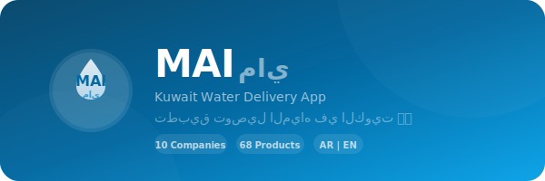
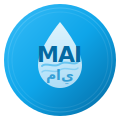
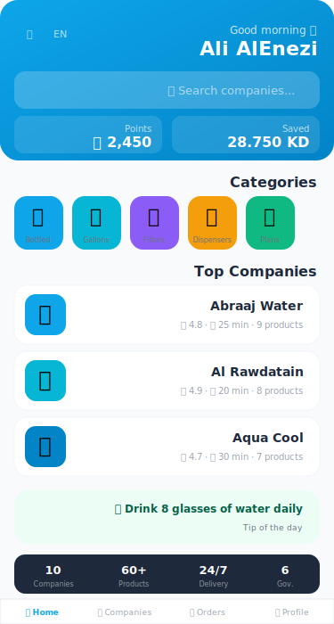
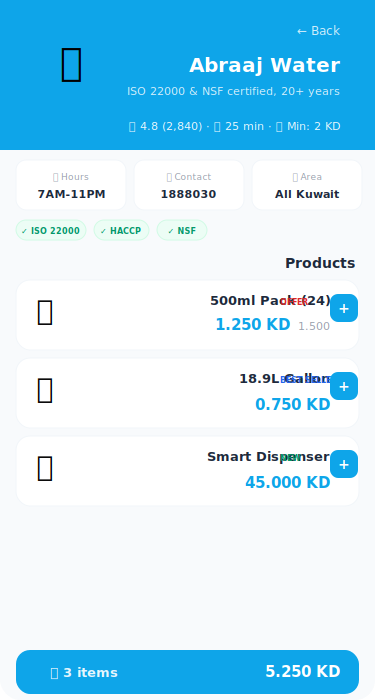
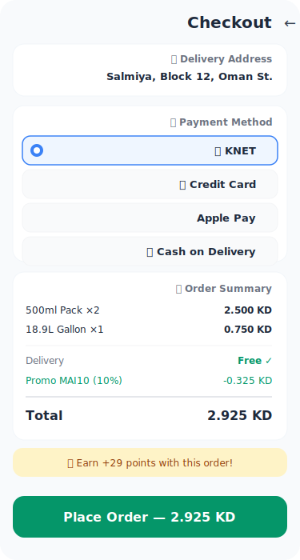
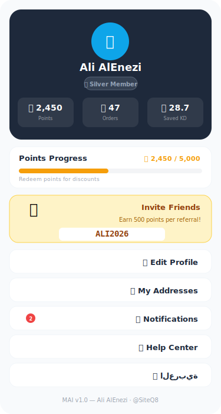
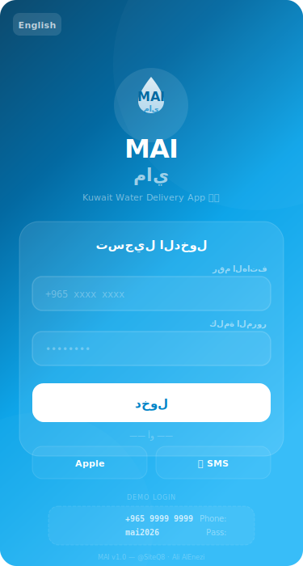

<div align="center">



<br/><br/>



### Kuwait Water Delivery App | تطبيق توصيل المياه في الكويت

[]()
[](LICENSE)
[]()
[]()
[]()
[]()

**MAI (ماي)** — "water" in Kuwaiti dialect — is a mobile-first water delivery marketplace connecting Kuwait's residents with local water companies. Browse companies, compare products, order gallons, filters, dispensers, and subscribe to delivery plans.

</div>

---

## 📱 App Screenshots

<div align="center">
  
  &nbsp;&nbsp;
  
  &nbsp;&nbsp;
  
  &nbsp;&nbsp;
  
</div>

<div align="center">
  
  &nbsp;&nbsp;
  
  &nbsp;&nbsp;
  
  &nbsp;&nbsp;
  
  &nbsp;&nbsp;
  
</div>

<div align="center">
  <sub>Login · Home · Company · Checkout · Profile</sub>
</div>

---

## 🏢 Water Companies (Demo Data)

All companies are **real Kuwait water brands** with demo product data:

| # | Company | Logo | Rating | Products | Phone | Specialty |
|---|---------|------|--------|----------|-------|-----------|
| 1 | **Abraaj Water** مياه أبراج | 💧 | ⭐ 4.8 | 9 | 1888030 | ISO 22000 · NSF · HACCP · Est. 2002 |
| 2 | **Al Rawdatain** الروضتين | 🏔️ | ⭐ 4.9 | 8 | 1828282 | Kuwait's leading bottler · Natural springs |
| 3 | **Aqua Cool** أكوا كول | 🌊 | ⭐ 4.7 | 7 | 1888030 | Free delivery · RO treated |
| 4 | **Aqua Gulf** أكوا جلف | 🌅 | ⭐ 4.6 | 5 | 50907710 | Mineral & alkaline water · UAE-based |
| 5 | **Al Ain Water** مياه العين | ⛰️ | ⭐ 4.7 | 5 | 60984798 | Zero sodium option · 24/7 delivery |
| 6 | **KD Cow** كي دي كاو | 🥛 | ⭐ 4.5 | 4 | 1800180 | Est. 1960 · Dairy + water · Cheapest |
| 7 | **Masafi** ماسافي | 🗻 | ⭐ 4.8 | 5 | 22450045 | Hajar Mountains · Most trusted Gulf brand |
| 8 | **Soft Water** سوفت ووتر | 🔧 | ⭐ 4.6 | 6 | 22273322 | Ecosoft Belgium agent · Filters & RO |
| 9 | **Watersouq** وتر سوق | 🛒 | ⭐ 4.5 | 5 | 22250025 | Online store · Premium imports (Fiji, Evian, Voss) |
| 10 | **ABC Water** مياه ABC | 🇰🇼 | ⭐ 4.4 | 4 | 24742666 | 100% Kuwaiti · Most affordable |

---

## ✨ App Features

### 🔐 Login Screen
- **Glassmorphism design** — frosted glass card on ocean gradient
- **Creative SVG logo** — water drop with waves, "MAI ماي" text
- **Demo credentials** — displayed below the form for easy testing
- **Phone + password** authentication
- **Social login** — Apple Sign-in and SMS code options
- **Remember me** checkbox
- **Forgot password** link
- **Bilingual toggle** — switch AR/EN right from login
- **Animated entry** — logo drops in, card fades up with staggered timing

**Demo Login:**
| Field | Value |
|-------|-------|
| Phone | `+965 9999 9999` |
| Password | `mai2026` |
| Quick | `demo` / `demo` |

### 🏠 Home Screen
- **Personalized greeting** — Good morning/evening with user name
- **Smart search** — Search companies by Arabic or English name
- **Points & savings dashboard** — Points earned + money saved
- **6 product categories** — Bottled, Gallons, Filters, Dispensers, Subscriptions, Accessories
- **Featured offers carousel** — Discount cards with percentage badges
- **Promo banners** — Horizontal scroll (first order, subscriptions, referrals)
- **Company directory** — All 10 companies with ratings, delivery time, product count
- **Water tips** — Daily hydration tips rotating automatically
- **Delivery areas** — 6 Kuwait governorates with delivery times
- **Stats bar** — 10 companies · 68+ products · 24/7 · 6 governorates

### 🏢 Company Pages
- **Company hero** — Logo, name, rating, reviews, delivery time, minimum order
- **Info cards** — Working hours, phone number, delivery coverage (horizontal scroll)
- **Certifications** — ISO, HACCP, NSF badges
- **Category filter** — Filter products by type
- **Product cards** — Name, description, price, old price, badge (Offer/New/Best Seller)
- **Quick add to cart** — One-tap with floating cart summary

### 🛒 Cart & Checkout
- **Cart management** — Quantities, remove items
- **Promo codes** — `MAI10` (10%), `FIRST` (15%), `WATER50`, `SUMMER`
- **Payment:** 🏧 KNET · 💳 Credit Card ·  Apple Pay · 💵 Cash on Delivery
- **Points preview** — See points you'll earn before ordering
- **Delivery address** — Saved addresses
- **Order summary** — Itemized with delivery fee and discounts

### 📦 Order Tracking
- **Active orders** — Live progress bar (Confirmed → Preparing → On the way → Delivered)
- **Past orders** — Full history with dates and totals
- **Order status badges** — Color-coded status indicators

### 👤 Profile & Rewards
- **Membership levels** — 🥉 Bronze · 🥈 Silver · 🥇 Gold
- **Points system** — 10 pts per 1 KD · Progress bar to next level
- **Referral program** — Code `ALI2026` · 500 pts per referral
- **Notifications** — Order updates, offers, points earned (with unread count)
- **Stats** — Total orders, points balance, money saved
- **Settings** — Edit profile, addresses, notifications, language, help center

### 🌐 Bilingual Support
- Full **Arabic** and **English** — all text, labels, product names, descriptions
- **RTL/LTR** layout auto-switching
- One-tap language toggle in header

---

## 📦 Product Categories (68 products)

| Category | Icon | Count | Price Range | Examples |
|----------|------|-------|-------------|---------|
| Bottled Water | 💧 | 30 | 0.250 - 5.500 KD | 200ml cups, 500ml, 1L, 1.5L, 5L packs |
| Gallons | 🪣 | 14 | 0.500 - 7.000 KD | 18.9L single, 5-pack, 10-pack bundles |
| Filters | 🔧 | 5 | 22.000 - 350.000 KD | 3/5/7-stage RO, central villa system |
| Dispensers | 🚰 | 4 | 28.000 - 55.000 KD | Countertop, floor, smart, hot/cold |
| Subscriptions | 📅 | 6 | 1.800 - 15.000 KD | Weekly, monthly, daily, family plans |
| Accessories | 🗄️ | 1 | 12.000 KD | Stainless steel gallon stands |
| Premium Import | 🌍 | 5 | 3.800 - 5.500 KD | Fiji, Evian, Voss, Badoit, San Pellegrino |
| Flavored | 🍋 | 1 | 0.250 KD | Masafi Touch (Lemon, Berry, Strawberry) |

---

## 💳 Payment Methods

| Method | Icon | Description |
|--------|------|-------------|
| KNET | 🏧 | Kuwait's national debit card network |
| Credit Card | 💳 | Visa, Mastercard |
| Apple Pay |  | One-tap mobile payment |
| Cash on Delivery | 💵 | Pay the driver |

---

## ⭐ Points & Rewards

```
┌──────────────────────────────────────────────┐
│  EARNING POINTS                              │
│  ─────────────                               │
│  Every 1 KD spent    → 10 points             │
│  First order bonus   → 100 points            │
│  Referral (per friend) → 500 points          │
│  Product review      → 25 points             │
│                                              │
│  MEMBERSHIP LEVELS                           │
│  ────────────────                            │
│  🥉 Bronze (0-999)    Standard benefits      │
│  🥈 Silver (1000-4999) +5% bonus, priority   │
│  🥇 Gold (5000+)       +10%, free delivery   │
│                                              │
│  REDEEMING POINTS                            │
│  ────────────────                            │
│  500 pts  → 0.500 KD discount                │
│  1000 pts → 1.250 KD discount                │
│  2500 pts → 3.500 KD discount                │
└──────────────────────────────────────────────┘
```

---

## 🗺️ Delivery Coverage

| Governorate | Key Areas | Time |
|-------------|-----------|------|
| العاصمة Capital | Sharq, Mirqab, Dasman, Kuwait City | 20-30 min |
| حولي Hawalli | Salmiya, Hawalli, Jabriya, Mishref, Bayan | 25-35 min |
| الفروانية Farwaniya | Farwaniya, Khaitan, Jleeb, Ardiya | 30-40 min |
| الأحمدي Ahmadi | Mangaf, Mahboula, Fintas, Abu Halifa | 30-45 min |
| الجهراء Jahra | Jahra, Sulaibiya, Doha, Naseem | 35-50 min |
| مبارك الكبير Mubarak | Sabah Al-Salem, Qurain, Adan | 25-40 min |

---

## 🚀 Getting Started

```bash
git clone https://github.com/SiteQ8/MAI.git
cd MAI
npm install
npm run dev
```

Open `http://localhost:5173`

### Demo Promo Codes

| Code | Discount |
|------|----------|
| `MAI10` | 10% off any order |
| `FIRST` | 15% off first order |

---

## 📂 Project Structure

```
MAI/
├── docs/
│   ├── MAI.jsx           # React app (792 lines, 66KB)
│   └── .nojekyll
├── screenshots/
│   ├── home.svg          # Home screen
│   ├── company.svg       # Company detail
│   ├── checkout.svg      # Checkout flow
│   └── profile.svg       # User profile
├── README.md             # Documentation
└── LICENSE
```

---

<div align="center">

### 💧 MAI — ماي

**Made with ❤️ in Kuwait 🇰🇼**

[Ali AlEnezi](https://github.com/SiteQ8) · [@SiteQ8](https://github.com/SiteQ8) · [3li.info](https://3li.info)

</div>
